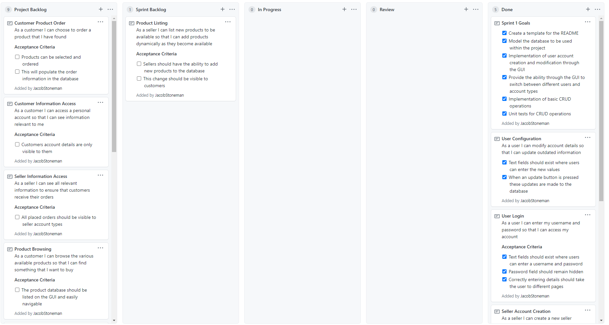
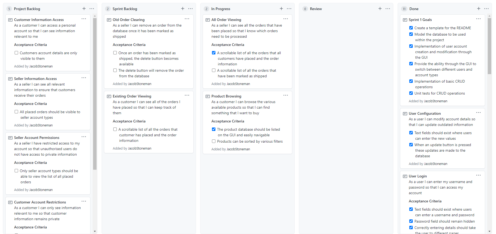
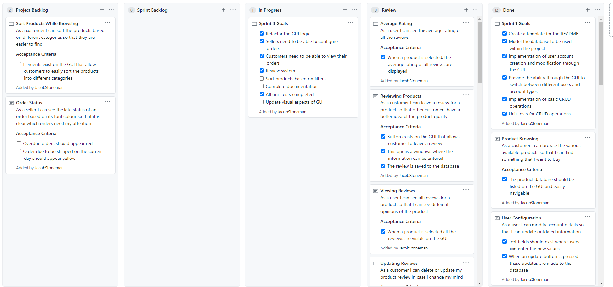

# Entity Framework Project

## Project Goal
The goal of this project is to create an application in which users can either buy or sell products. Customers should be able to browse through the products, place orders and view these orders. Sellers should be able to list all of their available products, view how well these products are doing and manage a list of all currently placed orders.

## Definition of Done
- [ ] Program should be fully functional, matching the minimum viable product specified
- [ ] Business layer should be fully unit tested
- [ ] GUI layer should be fully separated from business layer
- [ ] The project should be fully documented throughout the entire process
- [ ] User stories should be achieved

## Sprint 1
### Review
#### Sprint Goals
- [x] Create a template for the README
- [x] Model the database to be used within the project
- [x] Implementation of user account creation and modification through the GUI
- [x] Provide the ability through the GUI to switch between different users and account types
- [x] Implementation of basic CRUD operations
- [x] Unit tests for CRUD operations

#### Project Board 


#### User Stories Completed
* Product Browsing
* User Configuration
* User Login
* Seller Account Creation
* Customer Account Creation

### Retrospective
#### Overview
* Code first approach worked well and I was able to successfully create a database within the entity framework
* This was not completely without issue however and time was spent solving issues with the package manager console and rebuilding the database whenever these issues arose
* CRUD operations for the different entities currently in use were implemented successfully 
* CRUD operations for entities that are currently not implemented in the application do not exist yet such as Order operations
* All Unit tests for currently implemented CRUD operations are implemented and pass
* A parent CRUD manager was created that all other CRUD managers inherit from which allowed for generic operations such as SetSelected and RetrieveAll  to be simplified, as shown below:
``` C#
		public List<T> RetrieveAll<T>(DbSet<T> set) where T : class
		{
			using (ProjectContext db = new ProjectContext())
			{
				return set.ToList();
			}
		}
```
*  Time was spent learning the most effective methods to navigate between different pages and while this was achieved, there may be potential issues going forward which will have to be addressed in the next sprint
*  Both the Customer and Seller entities exist as children to the User entity and this is reflected in the database
*  All the sprint goals were achieved

#### Action Plan For Next Sprint
* Spend more time researching page navigation within WPF applications
* Continue developing CRUD operations for entities as they are implemented in the application
* Continue to complete the defined user stories

## Sprint 2
### Review
#### Sprint Goals
- [x] Complete layout of seller page on the GUI
- [x] Implementation of product listing including both creating and viewing products
- [x] Implementation of product viewing on the GUI for customers
- [x] Basic functionality for customers viewing and ordering products
- [x] Unit test new features

#### Project Board


#### User Stories Completed
* User Switching
* Product Information
* Customer Product Order
* Seller Page Layout
* Product Listing

### Retrospective
#### Overview
* Issues with page navigation have been solved and the implementation now uses frames to display different pages within a parent window
* This took longer than expected and left me with less time to focus on the other aspects of the sprint
* Despite this, the rest of the sprint goals were completed on time
* The product aspect of the application has been completed with the ability for sellers to now create and update different products and the customers to browse these products
* Most of the user interface has now been created despite not all the functionality being there
* Some logic within the GUI has been repeated and could instead be moved to a separate class, specifically the code used to display the product information
* New CRUD operations were implemented along side the new functionality
* These operations have been fully unit tested and pass

#### Action Plan For Final Sprint
* Going into the final sprint it will be important to organise the remaining project backlog by priority
* Most important is completing functionality and making sure all desired features are implemented
* There should also be a focus on improving the visual aspect of the application and refactoring the back end

## Sprint 3 - Final
### Review
#### Sprint Goals
- [x] Refactor the GUI logic
- [x] Sellers need to be able to configure orders
- [x] Customers need to be able to view their orders
- [x] Review system
- [ ] Sort products based on filters
- [ ] Complete documentation
- [x] All unit tests completed
- [ ] Update visual aspects of GUI

#### Project Board


#### User Stories Completed
* Average Rating
* Reviewing Products
* Viewing Reviews
* Updating Reviews
* Multiple Reviews
* Mark as Shipped
* Customer Account Restrictions
* Order Cancelling
* Customer Order Status View
* Existing Order Viewing
* Seller Account Permissions
* All Order Viewing
* Old Order Clearing

### Retrospective
#### Overview
* A large amount of work was left for this sprint which ultimately meant not everything was completed
* However work was organised by priority meaning the application is fully functional and meets the initial criteria I set at the beginning of the project
* Goals such as improving the visual aspects and minor, non-essential features were not implemented
* An issue arose where the order page and the product page had issues communicating with each other as they are both loaded at the same time within one window and to reflect a change from one on the other, the window had to be reloaded
* To solve this, I created a custom event system that allowed for the two pages to communicate without creating dependencies, as shown below
* The event is defined in a separate class and then can be subscribed to within the GUI frontend
``` C#
		public event Action OnNewOrderPlaced;
		public void NewOrderPlaced()
		{
			OnNewOrderPlaced?.Invoke();
		}
		
		CustomEvents.current.OnNewOrderPlaced += PopulateOrderList;
```
* All CRUD operations have been implemented
* Modifications were made to the entity framework to accommodate these new features
* Repeated logic within the GUI frontend has been abstracted and moved to a separate class
* These features and operations have been unit tested
* Due to time constraints not all of the initially defined user stories have been completed

#### Remaining User Stories
* Sort Products While Browsing
* Seller Order Status

## Project Retrospective
### What Have I Learned?
Throughout this project, I have successfully built on the previous knowledge I had in every aspect of this project.
Through experimenting with the entity framework and the code first approach, I have learnt the underlying logic in how the entities are linked together and how to correctly query the database to most efficiently return the results I need. I have also learnt the importance of planning the entity relationships from the beginning to avoid the need to remodel the database further down the line in order to accommodate new features. Testing CRUD operations has taught me the importance of unit testing as these would routinely find issues within the operations in an enclosed environment allowing me to debug and observe the issues without affecting the application. This ultimately improved the design of my methods as they would be written with testing in mind.
I was also faced with new challenges in how to layout the user interface and as previously mentioned, this took some time to try different things and see which worked best. Through doing this, I have found new ways to structure a WPF application to create both a more efficient UI and front end implementation. This project has also given me an appreciation and an understanding of the need for good documentation, the project board where I managed my user stories and sprint goals was pivotal in keeping me on track and showing my progress through the project.

### What Would I Do Differently Next Time?

By breaking the user stories down more efficiently early on I would have had a much better idea of how much work they would involve and therefore would be able to split my time more evenly between the three sprints. This would have been beneficial as it meant more time could be spent testing and refactoring existing features or potentially implementing even more features which I did not get time to complete. I would have also, before the project began, spent some time figuring out which technologies I may need that I am not confident in (i.e. page navigation and entity framework) and researched these topics further.

### What Would I Do Next?

Despite maybe not being reflected in the remaining user stories, there were a number of extra features that I initially wanted to implement but were ultimately cut as they were not essential. Alongside the remaining unfinished items in the sprint 3 goals such as a UI rework, these would be perfect candidates for features in version 2.

## Class Diagrams
